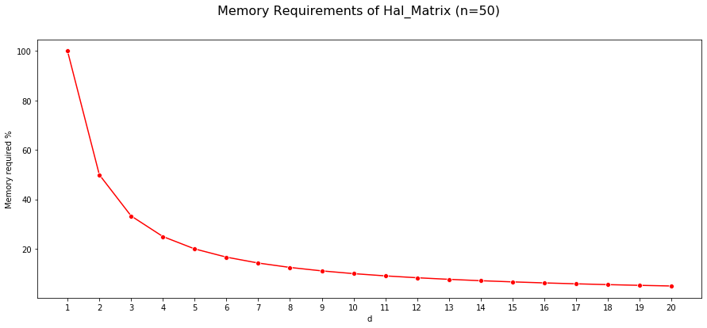
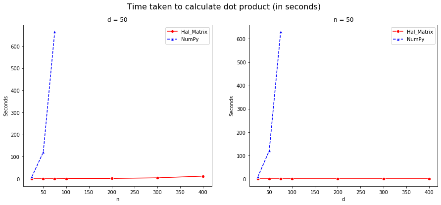
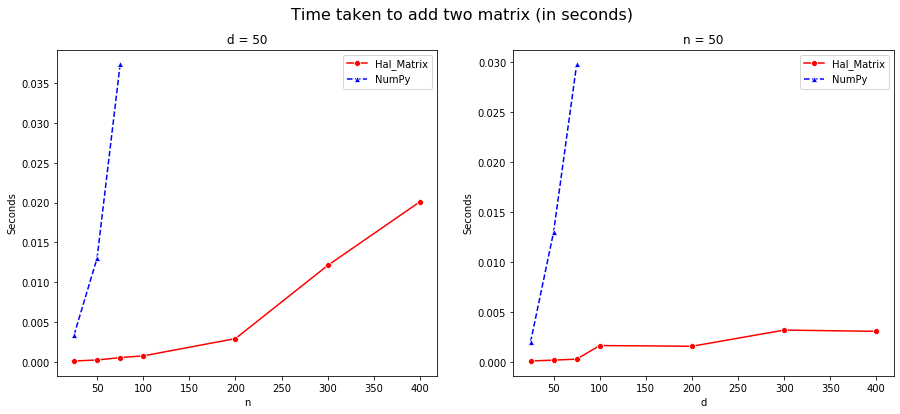
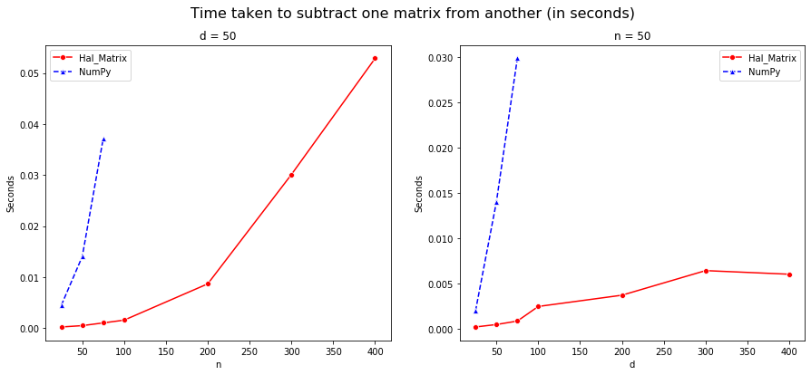
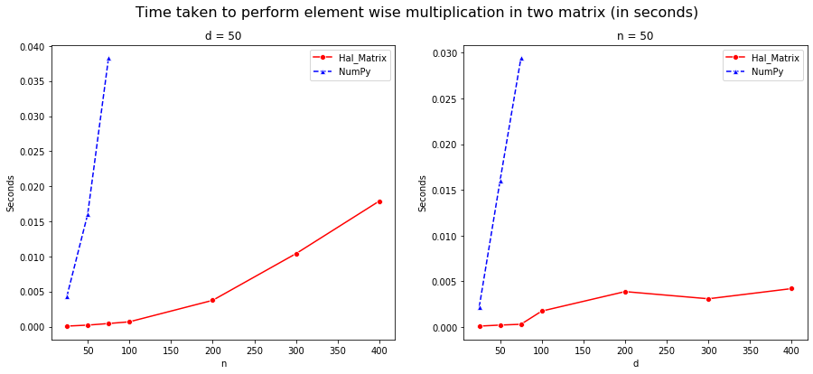

# HAL-Matrix

Consider a matrix A of size *<strong>R(nd x nd)</strong>*, where each non-overlapping *<strong>(d x d)</strong>* block of the matrix, *<strong>Dij</strong>*, is a diagonal matrix. So the matrix consists of *<strong>n2</strong>* such blocks. An example of such a matrix is shown below:

<!--  -->

For source code checkout "hal.py" file. 

## Comparision with NumPy arrays

